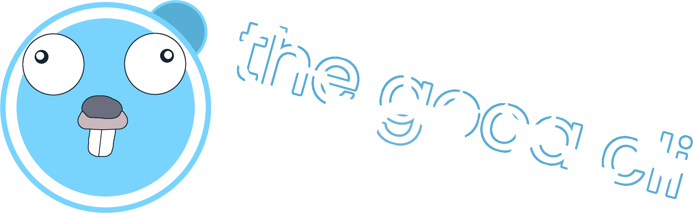

---
The Gooa CLI is the main CLI for interacting with the Gooa Programming Language.

You can read more about the language and tooling at [gooac.xyz](https://gooac.xyz)

# Installation
`go install github.com/gooac/gooac@latest`